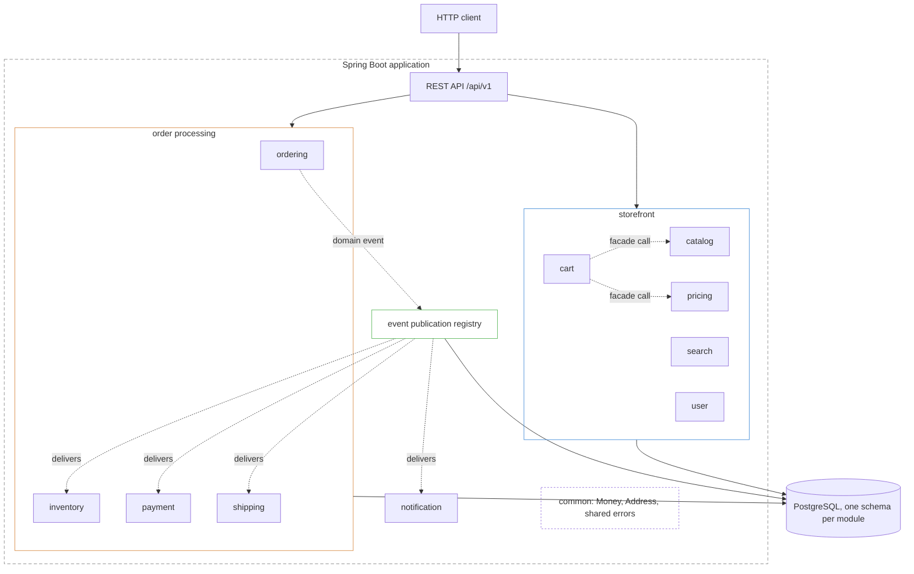

# Ecommerce Backend

Backend for an online store, inspired by how large shops like Amazon or Allegro work.
It is a modular monolith: one application that is split into domain modules with strict
boundaries between them. The frontend will live in a separate repository.

## What the system does

* Customers browse a product catalog, search it, and put products in a cart.
* A cart works for guests and for logged in users, and both carts are merged after login.
* Checkout turns a cart into an order, reserves stock, and starts a payment.
* When the payment succeeds, the order is confirmed and a shipment is created.
* The customer gets an email after every important change of the order.
* Admins manage products, categories, prices, stock levels, and orders.

## Architecture



Every domain module is a direct subpackage of `com.galileo.ecommerce` and has the same
inside structure:

| Package | Holds |
| --- | --- |
| `api` | REST controllers and request or response objects |
| `application` | use cases, transactions, publishing of events |
| `domain` | aggregates, value objects, domain events, repository interfaces |
| `infrastructure` | JPA repositories, clients of external systems, module configuration |

Modules talk to each other in only two ways:

1. **Facade call** when a module needs an answer right now, for example the cart asking
   the catalog for a product name. The facade is an interface in the root package of the
   module and it returns simple data objects, never JPA entities.
2. **Domain event** when a module states that something happened and does not wait for a
   reply, for example `ordering` publishing `OrderPlaced`. Events are written to the event
   publication registry inside the same database transaction as the business data, so an
   event cannot be lost when the application stops.

A module never reaches into another module: no injected repositories of other modules, no
imported entities, and no SQL joins across schemas. This is checked by a test, so a broken
boundary fails the build.

## Technology

| Area | Choice |
| --- | --- |
| Language | Java 25 |
| Framework | Spring Boot 4, Spring Modulith |
| Build | Maven, through the wrapper in the repository |
| Database | PostgreSQL 17 |
| Migrations | Flyway |
| Tests | JUnit 5, AssertJ, Testcontainers |
| Container runtime | Docker |
| Continuous integration | Jenkins |

## Requirements

* JDK 25
* Docker, running in the background

Maven does not have to be installed, the repository contains the Maven wrapper.

## Running the application

Create the local environment file from the example and fill in the values:

```bash
cp docker/.env.example docker/.env
```

Start the application:

```bash
./mvnw spring-boot:run
```

Spring reads `docker/compose.yaml` at startup, starts the PostgreSQL container, and
connects to it, so no database setup is needed. The container publishes the database on
host port `5433`, which keeps it away from a PostgreSQL that may already run on the
machine.

The application listens on port `8080`. To check that it is up:

```bash
curl http://localhost:8080/actuator/health
```

## Configuration

`application.yaml` holds settings that are true everywhere. `application-local.yaml` holds
settings that only make sense on a developer machine, such as starting the database
container and more detailed logging. The `local` profile is active by default and another
profile can be selected with the `SPRING_PROFILES_ACTIVE` environment variable, so the same
build runs in every environment.

Database credentials come from `docker/.env`, which stays out of the repository. Only
`docker/.env.example` is committed and it shows which keys are expected.

## Database

Flyway owns the database schema. Migrations live in `src/main/resources/db/migration` and
are named `V<number>__<description>.sql`, for example `V1__init.sql`. Flyway runs them at
startup and records them in the `flyway_schema_history` table.

A migration that has already been applied is never edited, every change is a new file.
Hibernate runs with `ddl-auto: validate`, so it only compares the entities with the
database and reports a mismatch instead of changing the schema.

## API conventions

* All endpoints are versioned and start with `/api/v1`.
* Errors are returned as `application/problem+json` in the format of RFC 7807, with a
  `title`, a `detail`, and the path in `instance`. Validation errors add an `errors` object
  that maps a field name to the reason it was rejected.
* `/actuator/health` and `/actuator/info` are open, the remaining actuator endpoints need
  authentication.

## Tests

```bash
./mvnw verify
```

The suite has three kinds of tests:

* unit tests of domain rules, without Spring,
* module tests that load a single module,
* integration tests that run against a real PostgreSQL started by Testcontainers.

Integration tests need Docker, so it has to run before the build starts. One more test
checks the module boundaries described above and fails the build when a module reaches
into another one.

## Project structure

```
ecommerce-backend/
├── docker/                  compose file and local environment values
├── docs/
│   └── adr/                 architecture decision records
├── src/main/java/com/galileo/ecommerce/
│   ├── common/              shared kernel and cross cutting configuration
│   └── <module>/            api, application, domain, infrastructure
├── src/main/resources/
│   ├── application.yaml     shared configuration
│   ├── application-local.yaml
│   └── db/migration/        Flyway migrations
├── src/test/java/           unit, module, and integration tests
├── Jenkinsfile              build pipeline
└── pom.xml
```

## Continuous integration

The `Jenkinsfile` describes the pipeline. The build stage runs `./mvnw clean verify` on a
clean checkout, the archive stage keeps the built jar, and test reports are published after
every run, also when the build is red.

## Decisions

Bigger technical decisions and the reasons behind them are written down as short documents
in `docs/adr`, so the history of the design can be read later.
